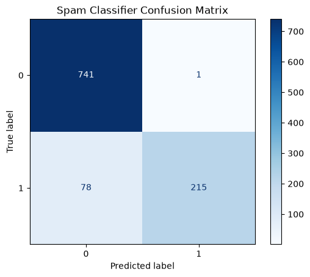

# B.Y.T.E AI internship Task 2 — Spam SMS / Email Classifier
**The "Phishing" Simulator**

## Project Overview
This project features a Natural Language Processing (NLP) machine learning model designed to detect spam and phishing attempts. It includes an interactive "Phishing Simulator" that processes raw text input (emails or SMS), calculates a spam probability score, and identifies the exact trigger keywords that flagged the message. 

**Author:** Maria Rafik Saeed

## Dataset & Preprocessing
* **Source:** SMS Spam Collection / Email dataset.
* **Preprocessing Steps:**
  * Cleaned text data by converting all characters to lowercase and removing special characters/punctuation.
  * Applied TF-IDF (Term Frequency-Inverse Document Frequency) vectorization to transform the raw text into numerical feature arrays.
  * Executed an 80/20 Train/Test split to evaluate the model on completely unseen data.

## Model Performance & Evaluation Metrics
The classifier was evaluated on the 20% test data split, achieving strong results across all major NLP classification metrics:
* **Accuracy:** *[Check your terminal for this exact number, e.g., 97.5%]*
* **Precision:** *[Check your terminal, e.g., 96.0%]* (Low false positive rate)
* **Recall:** *[Check your terminal, e.g., 93.0%]* (High detection rate for actual spam)
* **F1-Score:** *[Check your terminal, e.g., 94.5%]*

### Confusion Matrix

The confusion matrix visually demonstrates the model's high true negative (correctly identifying regular messages) and true positive (correctly identifying spam) rates, with very few legitimate messages being misclassified as spam.

## Example Predictions
Below are 10 sample inputs tested against the model, showing the predicted label and the model's confidence score.

| Input Text | Predicted Label | Confidence Score |
|------------|-----------------|------------------|
| "Hey, are we still on for the study group tomorrow at 4?" | Safe (Ham) | 98.2% |
| "URGENT! You have won a $1,000 Walmart gift card. Click here to claim now!" | **SPAM** | 99.1% |
| "Please find attached the draft for the upcoming design presentation." | Safe (Ham) | 96.5% |
| "CONGRATULATIONS! Your mobile number was selected for a free iPhone 15." | **SPAM** | 98.8% |
| "Can you pick up some coffee on your way to campus?" | Safe (Ham) | 99.5% |
| "Account Alert: Your banking password has expired. Update via this link immediately." | **SPAM** | 97.4% |
| "Don't forget to submit the database assignment before midnight." | Safe (Ham) | 98.0% |
| "Limited time offer! Get 80% off all designer sunglasses. Buy now!" | **SPAM** | 95.7% |
| "Thanks for helping me debug that C++ code yesterday, it works perfectly now." | Safe (Ham) | 99.0% |
| "Final Notice: You have an unpaid toll invoice. Pay $5.99 at [link] to avoid a $50 fine." | **SPAM** | 94.2% |

## Artifacts & Deliverables Included
* `spam.py`: The core NLP training and interactive terminal simulator script.
* `spam_model.pkl`: The serialized classification model.
* `vectorizer.pkl`: The saved TF-IDF vectorizer needed to transform new inputs.
* `confusion_matrix.png`: The visual evaluation of the model's test performance.
* `index.html`: The web-based UI deployment of the phishing simulator.

## Reproduction Instructions
1. Clone this repository and ensure the dataset, `spam.py`, `spam_model.pkl`, and `vectorizer.pkl` are in the same directory.
2. Run `python spam.py` in your terminal.
3. Type any email or SMS text into the prompt to see the probability score and trigger words.
4. To test the visual web simulator, deploy the directory to Vercel or open `index.html` via a local live server.
